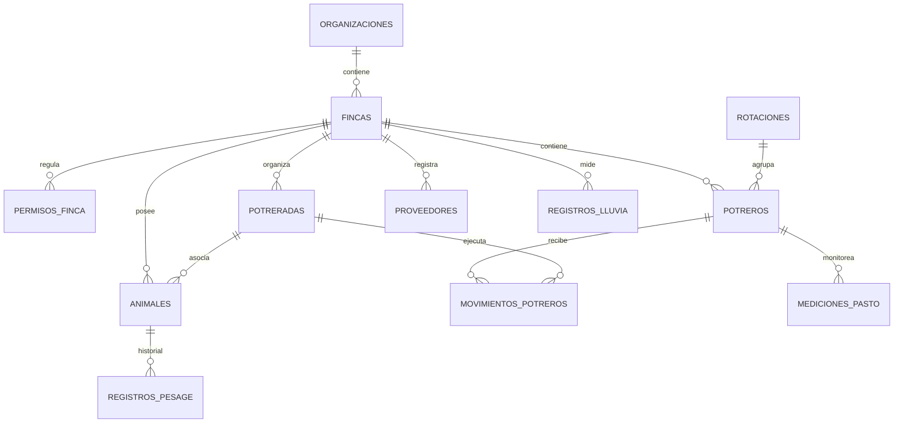

# Agrogestión (App-Ganadera) — Informe Técnico de Arquitectura y Alcance

Este documento describe de forma exhaustiva el diseño de software, la arquitectura de datos, los algoritmos zootécnicos, los flujos offline y el alcance completo de **Agrogestión** (anteriormente conocida como *App-Ganadera*). Está diseñado para servir como el manual de contexto de referencia definitivo para que modelos de lenguaje avanzado (como **Google Gemini**) entiendan el funcionamiento interno, las capacidades y el potencial de desarrollo de la plataforma.

---

## 1. Introducción y Propósito de la Aplicación

**Agrogestión** es una aplicación híbrida web/móvil diseñada para la administración y optimización zootécnica de operaciones ganaderas de cría, levante y ceba. 

### El Problema que Resuelve
En la ganadería tradicional, las decisiones de rotación de pastos, compra/venta de animales y administración sanitaria se toman basándose en la intuición o registros analógicos. Agrogestión digitaliza estos procesos, proporcionando análisis predictivo en tiempo real sobre:
1. **Rendimiento Individual y Colectivo**: Cuál es la ganancia real de peso por animal/lote y su eficiencia biológica.
2. **Capacidad de Carga de la Finca**: Cuántos días de pasto real quedan en cada potrero para evitar el sobrepastoreo o la desnutrición.
3. **Decisiones Comerciales de Precisión**: Cuándo un lote de ceba está listo para despacho optimizando el precio de venta en pie.
4. **Operación Rural Crítica (Offline)**: Permitir que los vaqueros registren aforos e inventarios en medio de potreros sin cobertura celular, sincronizándose de forma transparente al recuperar la red.

---

## 2. Stack Tecnológico

La aplicación está construida sobre un ecosistema de desarrollo moderno y altamente eficiente enfocado en alto rendimiento y escalabilidad nativa híbrida:

| Capa | Tecnología | Propósito |
| :--- | :--- | :--- |
| **Core Frontend** | React (v19.2) & TypeScript | Interfaz reactiva, estructurada y robusta con tipado estricto. |
| **Bundler & Dev Server** | Vite (v7.3) | Compilación y recarga ultrarrápida. |
| **Estilos (CSS)** | Vanilla CSS (Variables CSS) | Diseño premium adaptativo con animaciones fluidas, paleta de colores HSL estructurada y soporte de colapsabilidad inteligente para uso de escritorio y móvil. |
| **Manejo de Rutas** | `react-router-dom` (v7.1) | Enrutamiento SPA con protección de rutas (`ProtectedRoute`) y control de accesos basados en roles. |
| **Backend & Base de Datos** | Supabase (PostgreSQL) | Base de datos relacional robusta, autenticación nativa y APIs autogeneradas en tiempo real. |
| **Seguridad de Datos** | Row Level Security (RLS) | Aislamiento físico de la información a nivel de consulta SQL, restringiendo lecturas/escrituras según la organización y finca del usuario. |
| **Cálculo de Zootecnia** | PL/pgSQL Triggers (Postgres) | Procesamiento en base de datos para la Ganancia Diaria de Peso (GDP) y Ganancia Mensual de Peso (GMP), asegurando integridad física de datos y velocidad de consulta. |
| **Motor Mobile Híbrido** | Capacitor (v8.3) | Empaquetado nativo para Android e iOS a partir del código web. |
| **Actualizaciones OTA** | Capgo (`@capgo/capacitor-updater`) | Actualizaciones "Over-The-Air" instantáneas directamente en los dispositivos de los usuarios sin pasar por las tiendas de aplicaciones en cada compilación menor. |
| **Generación de Reportes** | `xlsx` (SheetJS), `jspdf` & `jspdf-autotable` | Exportación de informes y estadísticas financieras/inventarios a archivos Excel y PDF interactivos. |
| **Visualización** | `recharts` | Renderizado de gráficas interactivas para análisis de tendencias de peso, pluviometría e históricos. |

---

## 3. Modelo de Datos y Esquema de Base de Datos

El diseño de datos sigue una arquitectura jerárquica que permite la multitenencia. Un usuario autenticado pertenece a una **Organización** y puede acceder a una o más **Fincas** según sus **Permisos**.

### Tabla de Atributos del Esquema Principal (DDL de Supabase)

#### 1. Organizaciones y Fincas
*   **`organizaciones`**: Agrupación corporativa/familiar dueña de las tierras.
    *   `id` UUID (PK)
    *   `nombre` TEXT
    *   `id_dueño` UUID (Relación a `auth.users`)
*   **`fincas`**: Fincas físicas individuales.
    *   `id` UUID (PK)
    *   `id_organizacion` UUID (FK -> `organizaciones`)
    *   `nombre` TEXT
    *   `ubicacion` TEXT
    *   `area_aprovechable` NUMERIC (Hectáreas reales de pastoreo)

#### 2. Seguridad y Roles
*   **`permisos_finca`**: Vinculación de usuarios con fincas y roles de seguridad zootécnica.
    *   `id_usuario` UUID (FK -> `auth.users`)
    *   `id_finca` UUID (FK -> `fincas`)
    *   `rol` `rol_finca` (ENUM: `'administrador'`, `'vaquero'`, `'observador'`)

#### 3. Estructura de Pasturas
*   **`rotaciones`**: Agrupación lógica de potreros para ciclos de pastoreo.
    *   `id` UUID (PK), `nombre` TEXT, `id_finca` UUID (FK)
*   **`potreros`**: Lotes de terreno físicos donde se pastorea.
    *   `id` UUID (PK)
    *   `id_finca` UUID (FK)
    *   `nombre` TEXT
    *   `area_hectareas` NUMERIC
    *   `id_rotacion` UUID (FK -> `rotaciones` NULLABLE)
*   **`potreradas`**: Lotes de animales agrupados que se trasladan juntos por los potreros.
    *   `id` UUID (PK), `id_finca` UUID, `nombre` TEXT, `etapa` `etapa_animal` (ENUM: `'cria'`, `'levante'`, `'ceba'`)
*   **`movimientos_potreros`**: Registro histórico detallado de ocupación de potreros por potreradas.
    *   `id` UUID, `id_potrerada` UUID (FK), `id_potrero` UUID (FK), `fecha_entrada` DATE, `fecha_salida` DATE (NULL representa ocupación actual).

#### 4. Ganado y Producción
*   **`animales`**: Ficha técnica individual de cada animal.
    *   `id` UUID (PK)
    *   `id_finca` UUID (FK)
    *   `numero_chapeta` TEXT (Identificación única del animal por finca)
    *   `nombre_propietario` TEXT (Marca o socio inversionista)
    *   `proveedor_compra` TEXT, `observaciones_compra` TEXT
    *   `especie` `especie_animal` (ENUM: `'bovino'`, `'bufalino'`)
    *   `sexo` CHAR CHECK (`'M'`, `'H'`)
    *   `etapa` `etapa_animal`
    *   `fecha_ingreso` DATE, `peso_ingreso` NUMERIC
    *   `peso_compra` NUMERIC, `peso_ingreso_ceba` NUMERIC, `fecha_ingreso_ceba` DATE
    *   `id_potrero_actual` UUID (FK -> `potreros`), `id_potrerada` UUID (FK -> `potreradas`)
    *   `estado` `estado_animal` (ENUM: `'activo'`, `'vendido'`, `'muerto'`)
*   **`registros_pesaje`**: Historial longitudinal de peso del animal.
    *   `id` UUID (PK)
    *   `id_animal` UUID (FK -> `animales`)
    *   `peso` NUMERIC (Kg)
    *   `fecha` DATE
    *   `etapa` `etapa_animal`
    *   `id_potrero` UUID (FK -> `potreros`)
    *   `gdp_calculada` NUMERIC (Calculada por Trigger, representa ganancia diaria en kg)
    *   `gmp_calculada` NUMERIC (Equivalente mensual del trigger de zootecnia)

#### 5. Mapeos Ambientales y Productivos
*   **`registros_aforo`**: Mediciones del rendimiento del pasto (Kg/m²) e históricos.
    *   `id` UUID, `id_finca` UUID, `id_potrero` UUID, `fecha` DATE, `muestras` JSONB (Pesos físicos de forraje verde), `promedio_muestras_kg` NUMERIC, `viabilidad` NUMERIC (%), `aforo_real_kg` NUMERIC, `animales_presentes` INTEGER.
*   **`registros_lluvia`**: Seguimiento pluviométrico.
    *   `id` UUID, `id_finca` UUID, `fecha` DATE, `milimetros` NUMERIC, `notas` TEXT.
*   **`configuracion_kpi`**: Parámetros de negocio financieros y zootécnicos.
    *   `id_finca` UUID (Unique), `precio_venta_promedio` NUMERIC, `costo_mensual_animal` NUMERIC, `umbral_alto_gmp` NUMERIC, `umbral_medio_gmp` NUMERIC, `umbral_bajo_gdp` NUMERIC.

---

## 4. Zootecnia y Algoritmos Matemáticos Clave

Agrogestión destaca por trasladar la lógica agronómica y de zootecnia avanzada directamente al código y la base de datos:

### A. Ganancia Diaria (GDP) y Ganancia Mensual de Peso (GMP)
En lugar de procesar los cálculos de ganancia de peso en el frontend (lo cual provocaría problemas de rendimiento al cargar miles de registros), la plataforma calcula las ganancias de peso directamente en la base de datos usando **Triggers PL/pgSQL**.

#### Trigger 1: `calcular_gdp_al_pesar` (BEFORE INSERT OR UPDATE)
Al registrar un peso, se busca el pesaje inmediatamente anterior. 
*   **Si existe un pesaje previo**:
    $$\text{Días Transcurridos} = \text{Fecha Pesaje Nuevo} - \text{Fecha Pesaje Anterior}$$
    $$\text{GDP} = \frac{\text{Peso Nuevo} - \text{Peso Anterior}}{\text{Días Transcurridos}}$$
*   **Si es el primer pesaje**:
    $$\text{Días Transcurridos} = \text{Fecha Pesaje Nuevo} - \text{Fecha Ingreso Animal}$$
    $$\text{GDP} = \frac{\text{Peso Nuevo} - \text{Peso Ingreso}}{\text{Días Transcurridos}}$$

El valor se redondea a 3 decimales y se guarda en la columna `gdp_calculada`. En el frontend, este valor se multiplica por 30 para obtener el **GMP (Ganancia Mensual de Peso)**, el cual se semaforiza de acuerdo con los umbrales configurados para la finca:
*   $\text{GMP} > \text{Umbral Alto} \rightarrow$ **Verde (Desempeño Excelente)**
*   $\text{Umbral Medio} < \text{GMP} \le \text{Umbral Alto} \rightarrow$ **Blanco/Gris (Desempeño Aceptable)**
*   $0 \le \text{GMP} \le \text{Umbral Medio} \rightarrow$ **Naranja/Amarillo (Alerta de Desempeño)**
*   $\text{GMP} < 0 \rightarrow$ **Rojo (Pérdida de Peso - Crítico)**

#### Trigger 2: `recalcular_gdp_posterior` (AFTER INSERT OR UPDATE)
Si un usuario ingresa o edita un pesaje con fecha histórica (por ejemplo, registra hoy una pesada que ocurrió hace 15 días), este trigger busca el pesaje cronológicamente posterior y recalcula su ganancia de peso con respecto al nuevo dato ingresado. Esto garantiza que la curva de peso del animal nunca contenga saltos matemáticos ilógicos.

---

### B. Peso Estimado al Día de Hoy
Los pesajes reales se realizan periódicamente (por ejemplo, cada 30 o 45 días). Para planificar ventas o despachos, el Dashboard calcula un **Peso Estimado** en tiempo real extrapolando el crecimiento del animal desde su último pesaje:

$$\text{Días desde último pesaje} = \text{Fecha de Hoy} - \text{Fecha Último Pesaje}$$
$$\text{Peso Estimado} = \text{Último Peso Registrado} + \left( \text{Días desde último pesaje} \times \frac{\text{GMP Individual}}{30} \right)$$

*Si el animal no tiene registros de pesaje previos, se utiliza un factor de ganancia predeterminado según la zona (ej. 0.45 kg/día o 13.5 kg/mes).*

---

### C. Algoritmo de Próximos Despachos
El sistema cuenta con un motor analítico predictivo para alertar al ganadero sobre qué lote ("Potrerada") de la etapa de **Ceba** está más cerca de alcanzar el peso óptimo de comercialización (establecido en la industria en **530 kg**):

1.  Filtra únicamente los animales activos que se encuentran en la etapa de **Ceba**.
2.  Agrupa los animales por la **Potrerada** (lote) en la que se encuentran.
3.  Calcula el peso estimado al día de hoy para cada animal individual.
4.  Determina:
    *   `cantidad`: Número de animales totales en el lote.
    *   `listos`: Cuántos de esos animales ya superan los **530 kg** estimados.
    *   `gmpLote`: Promedio ponderado del GMP de todos los animales del lote.
5.  Calcula el tiempo estimado para finalizar el lote:
    $$\text{Kg Faltantes} = \max(0, 530 - \text{Peso Promedio Estimado del Lote})$$
    $$\text{Días Faltantes} = \frac{\text{Kg Faltantes}}{\text{GMP Promedio Lote} / 30}$$
6.  **Priorización**: El Dashboard expone el lote que tiene mayor porcentaje de animales listos o, en caso de empate, el lote con el peso promedio estimado más cercano al objetivo. Esto permite al usuario contratar transporte y planificar la logística de venta con precisión matemática.

---

### D. Aforo de Pasturas y Capacidad de Ocupación
El módulo de aforos permite determinar técnicamente cuánta comida produce un potrero para calcular la carga animal máxima sostenible.

1.  **Ingreso de Muestras**: El vaquero corta y pesa muestras de pasto en marcos de 1 metro cuadrado en al menos 8 puntos representativos del potrero.
2.  **Cálculo de Aforo Promedio**:
    $$\text{Promedio} = \frac{\sum \text{Muestras (Kg)}}{N \text{ Muestras}}$$
3.  **Aforo Disponible Real**: Multiplica el promedio por el área total del potrero y le aplica un porcentaje de viabilidad (aprovechabilidad real del pasto descontando pisoteo, malezas y desperdicio, típicamente entre 60% y 80%):
    $$\text{Aforo Real (Kg)} = \text{Promedio (Kg/m²)} \times (\text{Área del Potrero en Hectáreas} \times 10,000) \times \left( \frac{\% \text{ Viabilidad}}{100} \right)$$
4.  **Calculadora Bidireccional de Ocupación**:
    *   Si se conoce el número de animales y su consumo promedio diario de forraje (ej: 50 kg por res al día), calcula los **Días de Pastoreo Sostenibles**:
        $$\text{Días de Ocupación} = \frac{\text{Aforo Real (Kg)}}{\text{Número de Animales} \times \text{Consumo Diario (Kg)}}$$
    *   Si el usuario establece los días de permanencia deseados y el número de animales, calcula el consumo óptimo necesario.
    *   Si se establecen los días de pastoreo deseados y el consumo de forraje base, determina la **Carga Animal Máxima Sostenible (Número de reses)**.

---

## 5. Funcionalidades Módulo por Módulo

### 1. Dashboard de Indicadores e Inteligencia de Negocios
Presenta estadísticas integrales del estado productivo de la finca:
*   **Tarjetas de Resumen Rápido**: Carga animal total, mortalidad anualizada, hectáreas útiles e inventario actual.
*   **KPIs de Levante y Ceba**: Desglose de permanencia promedio (meses) y GMP por etapas, comparándolos contra la **Meta Mínima de Ganancia** calculada dinámicamente con la fórmula:
    $$\text{Meta Mínima (Kg)} = \frac{\text{Costo de Sostenimiento Mensual} / 0.6}{\text{Precio de Venta Promedio por Kg}}$$
*   **Distribución Estimada de Pesos**: Gráfica de barras que clasifica el ganado en 4 rangos clave (Menores a 430 kg, 431 a 480 kg, 481 a 530 kg, y mayores a 530 kg) usando los pesos estimados a la fecha actual para predecir volumen de venta disponible.
*   **Pluviometría Histórica**: Correlaciona la cantidad de lluvia caída en milímetros con las curvas de aumento de peso de la finca.

### 2. Inventario de Ganado Inteligente
*   Permite visualizar y editar la información de los animales.
*   Incluye búsqueda instantánea por número de chapeta y filtros multidimensionales (propietario, etapa, sexo, potreros y rotaciones).
*   Ofrece un generador de reportes de alta fidelidad que consolida en tiempo real un archivo Excel estructurado para juntas directivas o entidades de financiamiento agropecuario.

### 3. Historiales Financieros (Compras y Ventas)
*   **Mapeo de Compras**: Registro estructurado de la adquisición de ganado. Valida de manera estricta que los números de chapeta ingresados no existan previamente como activos para evitar duplicidades en el sistema. Genera un recibo/informe de compra formal en PDF con logotipos y resúmenes financieros.
*   **Liquidación de Ventas**: Procesa la salida de animales. Permite registrar peso de salida en báscula, merma comercial aplicada (porcentaje de pérdida por transporte) y calcula de forma individual el margen de utilidad bruto descontando el precio de compra original del animal.

### 4. Módulo de Potreradas y Rotación
*   Permite agrupar animales en lotes homogéneos denominados "Potreradas".
*   Muestra una vista interactiva de pesajes históricos organizada en columnas consecutivas de fechas (al estilo de una hoja de cálculo Excel), lo que permite a los zootecnistas y administradores ver la evolución del lote entero y detectar qué animales específicos se están quedando rezagados en el crecimiento.

### 5. Pluviometría
*   Módulo especializado para registrar y graficar lluvias diarias. Permite al administrador tomar decisiones sobre abonos, riego o suplementación nutricional anticipándose a las temporadas de sequía.

---

## 6. Mecanismo de Funcionamiento Offline y Sincronización

Uno de los principales retos del sector tecnológico agropecuario es la conectividad limitada. Para solucionar esto, Agrogestión incorpora un sistema de resiliencia de red de tres capas en el módulo de **Aforos**:

1.  **Detección Activa de Estado (Real Ping)**:
    En lugar de confiar en la propiedad básica de Javascript `navigator.onLine` (que solo indica si el dispositivo está conectado a un enrutador, mas no si este tiene acceso real a Internet), la aplicación realiza una consulta ultra liviana y rápida de comprobación hacia las APIs de Supabase.
2.  **Caché Contextual Local**:
    Durante la conexión online, la aplicación descarga y almacena en `localStorage` la configuración de KPIs de la finca, la lista completa de potreros disponibles y la información sobre ocupación actual de animales. Si el usuario ingresa a un potrero sin internet, la aplicación es capaz de mostrarle el área del potrero y cuántas reses están pastando en él para realizar cálculos en tiempo real sin conexión.
3.  **Cola de Sincronización Diferida (Offline Queue)**:
    *   Al guardar un aforo en estado offline, el software genera un identificador temporal único (`id_temp`) con el prefijo `aforo_`, construye el objeto de datos completo y lo inserta en una lista en `localStorage` (`agrogestion_aforos_offline`).
    *   La interfaz del usuario muestra de inmediato el registro en el historial con una etiqueta visual de **"Pendiente de Sincronización (Offline)"**, lo que permite seguir usando la calculadora de ocupación basada en ese aforo recién registrado.
    *   Tan pronto como el dispositivo detecta el restablecimiento del canal de internet, se activa un listener automático que recorre la cola diferida, envía uno a uno los registros pendientes a Supabase, elimina las claves temporales y refresca la base de datos central de forma transparente sin interrumpir el flujo de trabajo del usuario.

---

## 7. Puntos Clave para la Integración y Potencial con Gemini

Para un modelo de lenguaje avanzado como **Gemini**, este software representa un entorno idóneo para implementar inteligencia artificial predictiva y asistentes autónomos debido a su alto grado de estructuración y consistencia en los datos:

*   **Asistente Inteligente de Vaquería (Chatbot por Voz/Texto)**:
    Gemini puede conectarse a este esquema de base de datos para responder preguntas directas de vaqueros en campo, tales como: *"¿Cuándo fue el último pesaje del lote de ceba?"*, o *"¿Qué potrero tiene más días de pastura disponibles según el aforo de la semana pasada?"*.
*   **Motor de Alertas y Diagnóstico Sanitario**:
    Analizando los históricos de pesaje de la tabla `registros_pesaje`, Gemini puede identificar desviaciones negativas del GMP individual y sugerir tratamientos: *"El animal de chapeta #948 ha perdido 3 kg este mes en el potrero 'El Viento'; esto puede indicar parásitos o falta de agua en dicho potrero"*.
*   **Planificador Óptimo de Rotación de Pastos (Agro-Advisor)**:
    Cruzando los datos de la tabla `movimientos_potreros` con `registros_aforo` e históricos de la tabla `registros_lluvia`, la IA puede recomendar planes óptimos de rotación semanal para maximizar el descanso de las praderas y potenciar el rendimiento diario del pasto.
*   **Predicciones Financieras y Estrategia de Venta**:
    Analizando los costos mensuales de sostenimiento contra el GMP del ganado y los precios del mercado de la carne, Gemini puede emitir sugerencias comerciales: *"El lote 4 de ceba alcanzará su peso óptimo de 530 kg en 18 días. Se recomienda coordinar la venta con el comprador X ya que el costo diario de retenerlos posterior a ese peso reducirá tu margen neto en un 4% mensual"*.
