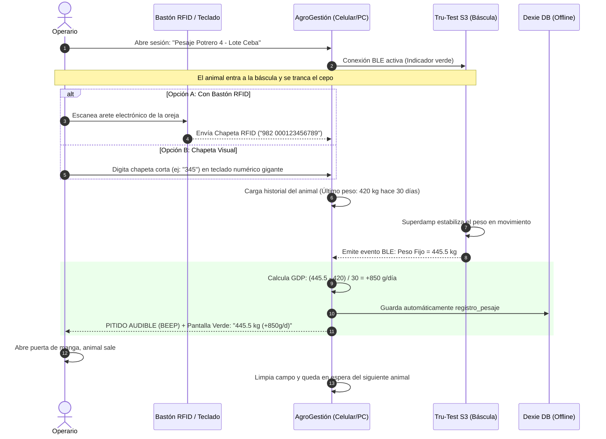

# Informe Técnico y Análisis Estratégico: Integración de Básculas Digitales Bluetooth (Tru-Test S3 / EziWeigh) con AgroGestión

**Documento:** Informe de Viabilidad, Protocolo de Comunicación y Plan de Implementación  
**Fecha:** 16 de Septiembre de 2026  
**Ecosistema Objetivo:** Aplicación Web & Móvil AgroGestión (React 19 + TypeScript + Capacitor 8 + Dexie Offline + Supabase)  
**Hardware de Referencia:** Tru-Test S3 / Serie EziWeigh (Datamars Livestock) y Lectores RFID  

---

## 1. Resumen Ejecutivo

En las operaciones ganaderas modernas, la jornada de pesaje en la manga o cepo es una de las tareas más críticas y a la vez más propensas a cuellos de botella y errores humanos. El método convencional —donde un operario mira el visor de la báscula, canta el peso a viva voz y otro operario lo anota en un cuaderno o intenta digitarlo en una aplicación con las manos sucias o bajo lluvia— genera:
1. **Pérdida de tiempo:** Entre 40 y 70 segundos por animal.
2. **Errores de transcripción:** Números transpuestos o lecturas inexactas por movimiento del animal.
3. **Estrés animal y fatiga del personal:** Tiempos prolongados de encierro y demoras en el flujo de la manga.

El objetivo de este proyecto es transformar AgroGestión en un **sistema de pesaje continuo manos libres**:
> **El operario solo ingresa o escanea la chapeta del animal. Tan pronto el animal pisa la plataforma y la báscula Tru-Test fija el peso, AgroGestión captura el valor automáticamente por Bluetooth, calcula la Ganancia Diaria de Peso (GDP) al instante, emite un aviso sonoro/visual y guarda el registro sin tocar la pantalla.**

El tiempo por animal se reduce a **5 - 8 segundos**, permitiendo procesar lotes de cientos de cabezas en una fracción del tiempo habitual.

---

## 2. Anatomía de la Báscula Tru-Test S3 / EziWeigh

### 2.1 La Tru-Test S3: El "Indicador Ciego" Diseñado para Móviles
A diferencia de los monitores industriales antiguos o de gama alta (como la Tru-Test XR5000) que incluyen pantallas táctiles complejas y teclados alfanuméricos completos, la **Tru-Test S3** fue concebida bajo una filosofía de diseño moderna:
* **Mínima interfaz física:** Solo tiene dos botones físicos (`Power` y `Cero / Tara`). No tiene teclado para escribir chapetas ni menús complicados en pantalla.
* **El teléfono o PC es el "Cerebro":** Datamars diseñó la S3 específicamente para delegar la interfaz de usuario, la identificación del animal y el almacenamiento de sesiones a un dispositivo móvil (smartphone o tablet) o PC conectado por Bluetooth.
* **Tecnología Superdamp™ III:** Algoritmo propietario de Tru-Test que filtra las vibraciones, patadas y balanceos del bovino dentro de la báscula, calculando y "bloqueando" (Lock) el peso exacto en un lapso de 3 a 5 segundos.
* **Conectividad:** Incorpora chip **Bluetooth Low Energy (BLE)** de bajo consumo y largo alcance.

### 2.2 Comparativa con Otros Modelos de Básculas Ganaderas
| Marca / Modelo | Tipo de Bluetooth | Protocolo Principal | Compatibilidad iOS | Compatibilidad Android / PC | Comentarios |
| :--- | :--- | :--- | :---: | :---: | :--- |
| **Tru-Test S3** | **BLE (Bluetooth 4.2/5.0)** | GATT Services / Notificaciones | ✅ Nativo sin MFi | ✅ Nativo (Web Bluetooth / Capacitor) | **Ideal para AgroGestión.** La más moderna y accesible. |
| **Tru-Test EziWeigh 7i** | Clásico + MFi / BLE | SPP (Serial) + iAP2 Apple | ✅ (Requiere chip MFi) | ✅ Vía COM Virtual / RFCOMM | Muy extendida en el mercado colombiano/latinoamericano. |
| **Gallagher W-0 / W-1 / W-210** | BLE / Clásico | Propietario Gallagher Animal Perf. | ✅ Limitado | ✅ Vía GATT / App bridge | Requiere inspección de tramas o puente de exportación. |
| **Balanzas Hook / Magris / Vesta** | Clásico (módulos tipo HC-05) | SPP Serial RS-232 (9600 bps) | ❌ Requiere BLE | ✅ Directo por puerto COM virtual | Muy populares en Argentina/Uruguay/Colombia. |
| **Genéricas con módulo ESP32/RS232** | BLE o Clásico | Emulación Serie ASCII | ✅ Si es BLE | ✅ Directo | Muy fáciles de integrar. |

---

## 3. ¿Cómo Funciona el Protocolo Bluetooth de las Básculas?

Para que AgroGestión hable con la báscula, debemos comprender las dos capas de la comunicación: el **canal de transporte inalámbrico** y el **formato del mensaje (trama de datos)**.

```
┌─────────────────────────┐          Bluetooth Low Energy (BLE)          ┌────────────────────────────────┐
│   Báscula Tru-Test S3   │ ───────────────────────────────────────────> │ Dispositivo (Celular / PC)     │
│                         │   GATT Service / Characteristic Notification │                                │
│ [Barras de Carga]       │                                              │ AgroGestión (Web / Capacitor)  │
│ [Algoritmo Superdamp]   │                                              │ - Detecta evento de peso       │
│ [Botón Cero/Power]      │                                              │ - Asocia a Chapeta activa      │
└─────────────────────────┘                                              │ - Calcula GDP vs peso anterior │
                                                                         │ - Guarda en Dexie (Offline)    │
                                                                         └────────────────────────────────┘
```

### 3.1 Canal de Transporte: BLE vs. Bluetooth Clásico (SPP)

1. **Bluetooth Low Energy (BLE - Tru-Test S3):**
   * Funciona mediante una arquitectura **GATT (Generic Attribute Profile)** compuesta por **Servicios** (UUIDs de 16 o 128 bits) y **Características**.
   * No requiere que el usuario vaya a la configuración del sistema operativo a emparejar con códigos PIN engorrosos (`0000` o `1234`). La aplicación escanea los dispositivos cercanos y se conecta en caliente.
   * **Modo de Notificación (Push):** La aplicación cliente (AgroGestión) se suscribe a la Característica de Peso. Cuando la báscula detecta que el peso se estabilizó, emite un paquete de datos por notificación (`Notify/Indicate`), despertando al instante el evento en el software.

2. **Bluetooth Clásico SPP (Serial Port Profile - EziWeigh 7 / Balanzas RS-232):**
   * Emula un cable serie RS-232 inalámbrico (RFCOMM).
   * En un PC o laptop, Windows/Mac le asigna un puerto COM virtual (ejemplo: `COM3` o `/dev/cu.TruTest`).
   * Transmite un flujo continuo de caracteres a una velocidad estándar (normalmente **9600 baudios, 8 bits de datos, sin paridad, 1 bit de parada: 8N1**).

### 3.2 La Trama de Datos (Formato del Mensaje)

Cuando la báscula Tru-Test envía el peso, no envía simplemente el número `"450"`; envía una trama estructurada que garantiza que los datos no se corrompan por interferencias de radio en el campo.

#### Formato Estándar Tru-Test (Trama Serial / BLE Payload):
```
[STX] [Signo] [Peso: 6 dígitos] [Posición Decimal] [Checksum: 2 Bytes Hex] [ETX]
```

* **`STX` (Start of Text):** Byte `0x02`. Indica el inicio de la lectura.
* **`Signo`:** `+` para peso positivo, `-` para tara negativa.
* **`Peso`:** 6 caracteres numéricos con ceros a la izquierda (ejemplo: `000452`).
* **`Posición Decimal`:** 1 dígito que indica dónde va el punto decimal (`0` = sin decimales, `1` = un decimal, ej. 452.0 kg).
* **`Checksum`:** 2 caracteres hexadecimales generados por operación XOR de los bytes intermedios para validar integridad.
* **`ETX` (End of Text):** Byte `0x03` o salto de línea (`\r\n`).

*Ejemplo Real:*
```text
\x02+0004520A4\x03
```
Interpretación en AgroGestión:
* Signo: `+`
* Valor: `452.0`
* Unidad: `kg`
* Estado: **Peso Válido y Estable**

#### Servicios GATT y Características en la Tru-Test S3:
La Tru-Test S3 expone dos posibles interfaces según el firmware:
1. **Weight Scale Service estándar de Bluetooth SIG:**
   * Service UUID: `0x181D`
   * Characteristic UUID: `0x2A9D` (Weight Measurement). Los bytes contienen banderas de estado, unidad (kg/lb) y el entero flotante del peso.
2. **Servicio Serie Propietario / Nordic UART Service (NUS):**
   * Service UUID: `6E400001-B5A3-F393-E0A9-E50E24DCCA9E`
   * TX Characteristic (Notify): `6E400003-B5A3-F393-E0A9-E50E24DCCA9E`
   * Transmite el string ASCII idéntico a la trama serial descrita arriba.

---

## 4. El Flujo de Operación Óptimo en Manga (Experiencia de Usuario)

Para que el pesaje sea ágil, AgroGestión debe operar como una **estación de pesaje autónoma** dentro de la manga.



### Ventajas Clave de este Flujo:
1. **Cero Clics para Guardar:** Al recibir el paquete de peso fijado y teniendo una chapeta seleccionada, la app no espera a que el operario presione "Guardar"; almacena el registro de inmediato.
2. **Feedback Sensorial:** En los corrales hay sol brillante (dificultad para ver pantallas) y mucho ruido. Un pitido sonoro agudo a través del parlante del celular o de un bafle Bluetooth le confirma al vaquero que el animal ya quedó registrado y puede abrir la puerta de salida.
3. **Control de Calidad en Vivo:** Si la báscula envía un peso que representa una pérdida anormal (ejemplo: -30 kg respecto al último pesaje), la app muestra una alerta en rojo para que el operario revise si el animal saltó o se apoyó mal en la plataforma antes de soltarlo.
4. **100% Funcional Offline:** En la manga casi nunca hay señal celular. AgroGestión guarda cada pesaje en **Dexie (IndexedDB local)** con marca de tiempo UTC e ID del animal. Cuando el operario regresa a la casa de la finca con Wi-Fi, los pesajes se sincronizan solos con Supabase.

---

## 5. Viabilidad y Arquitectura Técnica en AgroGestión

AgroGestión cuenta con una ventaja estructural enorme frente a otros desarrollos:
* Está construida sobre **React 19 + TypeScript + Vite**.
* Está empaquetada con **Capacitor 8** (disponible para compilar como App nativa en Android y iOS).
* Ya cuenta con **Dexie** y lógica de cálculo de GDP en tablas como `registros_pesaje`.

Existen dos vías de implementación según el dispositivo donde se use AgroGestión:

### Opción 1: En Computador Portátil (PC / Mac) o Tablet Android vía Web (Navegador Chrome/Edge)
* **Tecnología:** **Web Bluetooth API** (`navigator.bluetooth`) y **Web Serial API** (`navigator.serial`).
* **Ventaja:** No requiere instalar ninguna aplicación nativa ni pasar por Google Play o App Store. El usuario entra a `agrogestion.com` desde su laptop en el corral, hace clic en *"Conectar Tru-Test"*, el navegador muestra el diálogo nativo de Bluetooth y se conecta al instante.
* **Complejidad:** **Baja**. Funciona de forma nativa en navegadores modernos Chromium.

### Opción 2: En Celulares o Tablets con la App Instalada (Android e iOS)
* **Tecnología:** Plugin oficial de Capacitor para BLE:
  ```bash
  npm install @capacitor-community/bluetooth-le
  npx cap sync
  ```
* **Ventaja:** Funciona tanto en Android como en iOS (iPhone/iPad). Permite mantener la conexión activa en segundo plano y manejar permisos nativos de Bluetooth del dispositivo móvil.
* **Complejidad:** **Media-Baja**. La librería es madura, cuenta con soporte para Capacitor 7/8 y permite escaneo, conexión y suscripción a notificaciones GATT con pocas líneas de código.

---

## 6. Matriz de Complejidad de la Implementación

| Módulo / Tarea | Descripción Técnica | Nivel de Complejidad | Tiempo Estimado |
| :--- | :--- | :---: | :---: |
| **1. Módulo Bluetooth Core** (`useBluetoothScale.ts`) | Hook de React que maneja escaneo, conexión, reconexión automática y suscripción a notificaciones BLE. | **Medio** | 2 - 3 días |
| **2. Parser de Tramas** (`truTestParser.ts`) | Algoritmo que recibe el flujo de bytes/strings, valida checksums y extrae el valor numérico limpio. | **Bajo** | 1 día |
| **3. Pantalla "Pesaje Rápido en Manga"** | Vista dedicada con números gigantes de alto contraste, teclado numérico táctil optimizado y selector de potrero/lote. | **Bajo** | 2 días |
| **4. Integración Offline (Dexie) y Triggers** | Guardado local instantáneo en la tabla `registros_pesaje` y cálculo de GDP en vivo. | **Bajo** (Ya existe la base) | 1 día |
| **5. Sonidos y Feedback Sensorial** | API de Audio web para pitido de confirmación y alertas de pérdida de peso. | **Muy Bajo** | 0.5 días |
| **6. Pruebas y Calibración en Campo** | Validación con la báscula real en corral con animales en movimiento. | **Medio** | 1 - 2 días |
| **TOTAL ESTIMADO** | **Solución completa lista para producción** | **MEDIO** | **~1 a 2 semanas** |

---

## 7. ¿Qué Necesitamos Conseguir para Llevar a Cabo el Desarrollo?

Para iniciar el desarrollo e implementación de esta funcionalidad, se requiere el siguiente inventario:

### 7.1 Hardware Físico para Pruebas
1. **Indicador de Báscula Tru-Test:**
   * El indicador **Tru-Test S3** (o EziWeigh 7i con Bluetooth encendido).
   * Si las barras de pesaje físicas están instaladas en la finca y el indicador está en la ciudad, se puede probar el indicador en mesa: el indicador enciende y transmite tramas de `0.0 kg` o pesos simulados al presionar o configurar la tara.
2. **Dispositivos de Prueba:**
   * Un celular o tablet **Android** (Android 10 o superior con Bluetooth 4.2+).
   * Un computador portátil con **Google Chrome** o **Microsoft Edge**.
   * (Opcional) Un dispositivo **iOS (iPhone o iPad)** si se desea compilar y validar la app para el ecosistema Apple.
3. **(Opcional para fase 2) Bastón Lector RFID:**
   * Un bastón lector EID (ejemplo: Tru-Test SRS2 / XRS2 o Allflex). Muchos de estos bastones pueden configurarse en modo **Bluetooth HID (teclado)**, lo que significa que al escanear la oreja del animal, "escriben" la chapeta automáticamente en el campo de texto activo sin requerir código especial.

### 7.2 Herramientas de Diagnóstico Gratuitas (Día 1 de Desarrollo)
Antes de escribir la primera línea de código, necesitamos "radiografiar" la Tru-Test S3 para confirmar exactamente sus UUIDs de servicio y formato de trama. Esto se hace en 15 minutos con:
* **nRF Connect for Mobile:** Aplicación gratuita (disponible en Android y iOS de Nordic Semiconductor). Permite descubrir la báscula, ver sus Servicios GATT, sus Características y leer los paquetes que transmite al enviar peso.
* **Serial Bluetooth Terminal:** Aplicación gratuita para Android para ver el texto plano en caso de conexión clásica SPP.
* **Consola de Bluetooth de Chrome:** `chrome://bluetooth-internals` para depurar conexiones en la computadora.

### 7.3 Dependencias de Código a Agregar al Proyecto
* `@capacitor-community/bluetooth-le`: Para la gestión nativa de Bluetooth en Android e iOS.

---

## 8. Hoja de Ruta (Roadmap) de Implementación Paso a Paso

```
FASE 1: Diagnóstico y Sniffing
  ├── Encender Tru-Test S3
  ├── Escanear con nRF Connect en el móvil
  └── Registrar Service UUID, Characteristic UUID y trama hexadecimal/ASCII
         │
FASE 2: Capa de Servicio Bluetooth en TypeScript
  ├── Crear servicio agnóstico (Web Bluetooth para PC / Capacitor para móvil)
  ├── Desarrollar parser con validación de expresiones regulares / bytes
  └── Crear hook de React `useBluetoothScale` con estados: `conectado`, `pesando`, `pesoFijo`
         │
FASE 3: Vista de "Pesaje Rápido en Manga" (UI/UX)
  ├── Diseño de alta legibilidad para sol y exteriores
  ├── Campo de Chapeta con auto-enfoque permanente (compatible con lectores RFID)
  ├── Cálculo dinámico de GDP en memoria comparando con último pesaje
  └── Almacenamiento directo en Dexie.js (100% Offline)
         │
FASE 4: Pruebas de Campo y Robustez
  ├── Manejo de pérdida de conexión (reconexión automática silenciosa)
  ├── Filtro de doble pesaje (evitar guardar el mismo animal dos veces por error)
  └── Sincronización automática con Supabase al recuperar señal
```

---

## 9. Prototipo de Código Conceptual

A continuación se muestra un ejemplo de cómo luce el lector de peso utilizando la **Web Bluetooth API** estándar, compatible directamente en Chrome/Edge:

```typescript
// src/services/truTestBleService.ts

export interface WeightReading {
  weight: number;
  unit: 'kg' | 'lb';
  isStable: boolean;
  timestamp: Date;
}

export class TruTestBleService {
  private device: BluetoothDevice | null = null;
  private characteristic: BluetoothRemoteGATTCharacteristic | null = null;

  async connect(onWeightReceived: (reading: WeightReading) => void): Promise<void> {
    try {
      // 1. Solicitar dispositivo Tru-Test cercano
      this.device = await navigator.bluetooth.requestDevice({
        filters: [
          { namePrefix: 'Tru-Test' },
          { namePrefix: 'S3' },
          { services: ['0000181d-0000-1000-8000-00805f9b34fb'] } // Weight Scale Service
        ],
        optionalServices: [
          '6e400001-b5a3-f393-e0a9-e50e24dcca9e', // Nordic UART Service (si aplica)
          'generic_access'
        ]
      });

      // 2. Conectar al servidor GATT
      const server = await this.device.gatt?.connect();
      if (!server) throw new Error('No se pudo conectar al servidor GATT');

      // 3. Obtener el servicio y la característica de medición
      const service = await server.getPrimaryService('0000181d-0000-1000-8000-00805f9b34fb');
      this.characteristic = await service.getCharacteristic('00002a9d-0000-1000-8000-00805f9b34fb');

      // 4. Suscribirse a las notificaciones en tiempo real
      await this.characteristic.startNotifications();
      this.characteristic.addEventListener('characteristicvaluechanged', (event: any) => {
        const value = event.target.value as DataView;
        const reading = this.parseWeightData(value);
        if (reading) {
          onWeightReceived(reading);
        }
      });

      console.log('Báscula Tru-Test conectada exitosamente');
    } catch (error) {
      console.error('Error al conectar con la báscula:', error);
      throw error;
    }
  }

  private parseWeightData(data: DataView): WeightReading | null {
    // Parser de trama según flags de Weight Scale Service (IEEE-11073 o ASCII de Tru-Test)
    // Ejemplo simplificado para Weight Scale Service estándar:
    const flags = data.getUint8(0);
    const isLbs = (flags & 0x01) !== 0;
    const rawWeight = data.getUint16(1, true); // Little-endian
    
    // Factor de resolución típico (0.5 kg o 0.1 kg)
    const weight = rawWeight * 0.1;

    return {
      weight: parseFloat(weight.toFixed(1)),
      unit: isLbs ? 'lb' : 'kg',
      isStable: true,
      timestamp: new Date()
    };
  }

  disconnect() {
    if (this.device?.gatt?.connected) {
      this.device.gatt.disconnect();
    }
  }
}
```

---

## 10. Conclusión y Recomendación

La integración de la báscula **Tru-Test S3** con **AgroGestión** no solo es completamente viable técnicamente, sino que representa una de las mejoras con mayor impacto comercial y operativo para la plataforma:
1. **La Tru-Test S3 es la aliada perfecta:** Su arquitectura nativa Bluetooth Low Energy (BLE) elimina las restricciones de hardware y licencias complejas, permitiendo conexión directa con laptops, tablets Android y celulares.
2. **AgroGestión ya tiene la base idónea:** La arquitectura offline con **Dexie**, la base de datos Supabase con triggers de GDP y el empaquetado con **Capacitor** permiten que esta funcionalidad opere en el corral sin internet y se sincronice sola.
3. **El siguiente paso:** Lo único necesario para arrancar el desarrollo es disponer del indicador Tru-Test S3 y realizar una sesión de captura de tramas (sniffing) de 30 minutos con la app gratuita *nRF Connect*, con lo cual podremos construir el hook de conexión y la pantalla de pesaje rápido en cuestión de pocos días.
